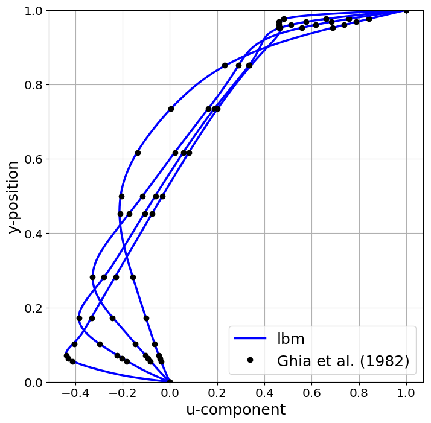
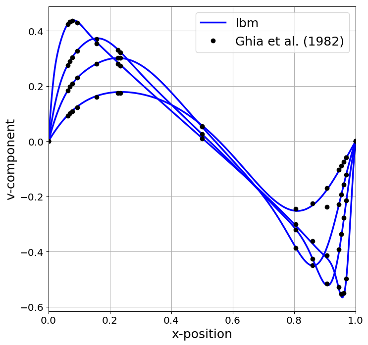

# lbm2d-mpi-kokkos
## Overview
lbm2d-mpi-kokkos is a C++ 2D weakly compressible fluid flow solver written for distributed CPUs or GPUs. The app is built on top of Sandia National Lab's performance portable Kokkos library. The majority of the app was written while attending a Kokkos workshop hosted by ORNL in July of 2018. Boundary conditions are specific to the 2D lid driven cavity. If you want something else, feel free to modify/extend the code.

## Build
```bash
mkdir proj
cd proj
git clone https://github.com/vasylivy/lbm2d-mpi-kokkos.git
```
Edit `lbmd2d-mpi-kokkos/lbm2d/Makefile` and set the device, architecture, and path for Kokkos. For example, setting `KOKKOS_DEVICES = OpenMP` and `KOKKOS_ARCH = SNB` will compile for Sandy Bridge Intel CPUs + OpenMP. Setting `KOKKOS_DEVICES = Cuda` and `KOKKOS_ARCH = SNB, Maxwell52`, will compile for a Sandy Bridge Intel CPU +  Nvidia GTX Titan X. A list of architecture flags, as well as other Kokkos compilation flags can be found [here](https://github.com/kokkos/kokkos/wiki/Compiling). The default Kokkos path is `KOKKOS_PATH = ../../Kokkos/kokkos`. While still in the proj directory, execute the following cmds to download Kokkos

```bash
mkdir Kokkos
cd Kokkos
git clone https://github.com/kokkos/kokkos.git
```
To build the executable

```bash
cd ../lbm2d-mpi-kokkos/lbm2d
mkdir release
make -j
```
The app will be compiled to the `release` directory as `lbm.host` or `lbm.cuda` depending on if it is an OpenMP or Cuda build.

## lattice Boltzmann method

The LBM implementation uses the BGK collision operator, D2Q9 quadrature for velocity space, and half-way bounce back for the boundary conditions. For collision-streaming, an A-B pattern is used. That is 9 distriubtions are read from array A, collided, and then streamed to array B. After applying boundary conditions, pointers to the arrays are then swapped. This collision-streaming pattern requires 2x the memory storage but is easy to implement. Details and further references regarding LBM can be found in Kruger's et al. text [[1]](https://link.springer.com/content/pdf/10.1007/978-3-319-44649-3.pdf).

## Running the 2D lid driven cavity
After compilation, execute the cmds

```bash
cd lbm2d-mpi-kokkos/cavity2d
./run.sh
```
The app outputs macroscopic variables to `cavity2d/output/` as `.bin` files based on the specified output rate until steady state is reached or the number of maximum steps is exceeded.

Results can be plotted and compared to the Ghia data set using `plot.py` as follows

```bash
python3 ../scripts/plot.py -reynolds 100 400 1000 5000 -nx 512 -ny 512 -ulid 0.1
```
The python scripts assumes the `output` for a desired Reynolds number has been moved to its own directory. For `Re=100` with a domain size of `512x512`, the output should be moved to a directory `re100_512x512`. By default, a row major (C/C++) data format is assumed. An optional `-cuda 1` flag can be passed to specify to read the `*.bin` using column-major (Cuda/Fortran) data format.

## Validation

The lid driven cavity is an enclosed flow driven by the movement of a lid. Below a critical Reynolds number, the flow is steady. The figures below compare the horizontal and vertical component of velocity at the vertical centerline and horizontal centerline for different Reynolds numbers (`Re = 100, 400, 1000, 5000`) against Ghia et al. (1982) results. The LBM simulations use a domain size of `512x512` corresponding to a spatial resolution of `510x510`.

<p align="center">
  
  
</p>

## Colorful Fluid Dynamics 

Below are animations of the velocity magnitude (left) and vorticity (right) for the 2D lid driven cavity over the first 25 million steps. This unsteady flow corresponds to a Reynolds number of `Re=25000` resolved on `2048x2048` domain with a lid speed set to `ulid = 0.01` which results in a Mach number `Ma ~ 0.017`. A single Nvidia GTX Titan X was used with a throughput of approximately ~1.3 BLUPs (Billion Lattice Updates Per Second).

<p align="center">
  
  
</p>

The python script `scripts/dump_frames.py` can be called to dump images of the vorticity or velocity magnitude to the current directory.

```bash
python3 ../../scripts/animate.py -re 25000 -nx 2048 -ny 2048 -umax 0.01 -cuda 1 -curl 0
```

Use the `ffmpeg` library to generate the GIF animation

```bash
ffmpeg -v 0 -i img_%03d.png -vf palettegen -y palette.png
ffmpeg -v 0 -framerate 10 -loop 0 -i img_%03d.png -i palette.png -lavfi paletteuse -y out.gif
```

## Performance 

### Kokkos profiling tools

Kokkos provides profiling tools that can be useful to get a quick estimate of performance critical regions. The wiki is found here: https://github.com/kokkos/kokkos-tools/wiki

Clone the `kokkos-tools` repository to the `Kokkos` directory and build thee space-time-stack profiling tool

```
git clone https://github.com/kokkos/kokkos-tools.git
cd kokkos-tools/src/tools/space-time-stack
make
export KOKKOS_PROFILE_LIBRARY=$PWD/kp_space_time_stack.so
```

Setting `KOKKOS_PROFILE_LIBRARY` environment variable to point to `kp_space_time_stack.so` will generate a Kokkos profiling report when your code exits. An example profiling report is shown below. We see the time spent per Kokkos parallel region as well as the memory-allocation breakdown. For the `512x512` domain tested here, roughly 87% of our time is spent in colliding and streaming. 

```
BEGIN KOKKOS PROFILING REPORT:
TOTAL TIME: 10.337 seconds
TOP-DOWN TIME TREE:
<average time> <percent of total time> <percent time in Kokkos> <percent MPI imbalance> 
<remainder> <kernels per second> <number of calls> <name> [type]
=================== 
|-> 9.03e+00 sec 87.3% 100.0% 0.0% ------ 20000 collision_streaming [for]
|-> 3.66e-01 sec 3.5% 100.0% 0.0% ------ 20000 bb_west [for]
|-> 2.54e-01 sec 2.5% 100.0% 0.0% ------ 20000 bb_east [for]
|-> 2.45e-01 sec 2.4% 100.0% 0.0% ------ 20000 bb_north [for]
|-> 2.35e-01 sec 2.3% 100.0% 0.0% ------ 20000 bb_south [for]

BOTTOM-UP TIME TREE:
<average time> <percent of total time> <percent time in Kokkos> <percent MPI imbalance> 
<number of calls> <name> [type]
=================== 
|-> 9.03e+00 sec 87.3% 100.0% 0.0% ------ 20000 collision_streaming [for]
|-> 3.66e-01 sec 3.5% 100.0% 0.0% ------ 20000 bb_west [for]
|-> 2.54e-01 sec 2.5% 100.0% 0.0% ------ 20000 bb_east [for]
|-> 2.45e-01 sec 2.4% 100.0% 0.0% ------ 20000 bb_north [for]
|-> 2.35e-01 sec 2.3% 100.0% 0.0% ------ 20000 bb_south [for]

KOKKOS HOST SPACE:
=================== 
MAX MEMORY ALLOCATED: 43056.0 kB
MPI RANK WITH MAX MEMORY: 0
ALLOCATIONS AT TIME OF HIGH WATER MARK:
  42.8% fB
  42.8% fA
  4.8% rho
  4.8% u
  4.8% v

KOKKOS CUDA SPACE:
=================== 
MAX MEMORY ALLOCATED: 0.0 kB
MPI RANK WITH MAX MEMORY: 0
ALLOCATIONS AT TIME OF HIGH WATER MARK:

Host process high water mark memory consumption: 55016 kB
  Max: 55016, Min: 55016, Ave: 55016 kB

END KOKKOS PROFILING REPORT.

```
### Shared Memory

The table below summarizes shared memory performance of the code for different hardware as the domain size `NxN` is varied. The data is reported in Millions of Lattices Updates per Second (MLUPs). The columns `32T, 16T ... 1T` correspond to a dual socket E5-2670 system and indicate how many threads were used. For this dual socket system, the following mpirun cmd was used

```
mpirun -N 1 -bind-to none -x OMP_NUM_THREADS=$num_threads -x OMP_PROC_BIND=spread -x OMP_PLACES=threads $app $arg1 $arg2 ...
```

whereas for the single GPU systems, the mpirun cmd was

```
mpirun -N 1 $app $arg1 $arg2
```

| N    | GTX Titan X | ½ Tesla K80 | Tesla V100 | 32T           | 16T           | 8T           | 4T           | 2T           |           1T |
|:----:|:-----------:|:-----------:|:----------:|:-------------:|:-------------:|:------------:|:------------:|:------------:|:------------:|
| 64   | 0           | 98          |    168     | 50            | 78\.6         | 77\.8        | 58\.8        | 40\.9        | 32\.2        |
| 128  | 354         | 268         |    703     | 176           | 194           | 134          | 79\.5        | 44\.7        | 33\.3        |
| 256  | 985         | 565         |    2668    | 371           | 288           | 167          | 88\.6        | 46\.1        | 30\.9        |
| 512  | 1360        | 789         |    3714    | 523           | 309           | 165          | 85\.4        | 41\.6        | 29\.9        |
| 1024 | 1360        | 884         |    4326    | 310           | 279           | 152          | 77\.8        | 39\.5        | 28\.6        |
| 2048 | 1380        | 936         |    4696    | 309           | 282           | 153          | 76\.3        | 38\.4        | 26\.8        |
| 4096 | 1340        | 912         |    4628    | 216           | 268           | 147          | 73\.5        | 37\.2        | 26           |
| 8192 | 1290        | 894         |    4770    | 143           | 186           | 128          | 65\.1        | 35\.3        | 25\.6        |

### Distributed Memory

#### Cuda-aware MPI

An distributed GPU program will require device-to-host and host-to-device memory copies in order to avoid invalid memory accesses. However, if multiple GPUs are on a single compute node, then a Cuda-aware MPI implementation will allow you to bypass the memory copies with a cheaper direct Peer-to-Peer (P2P) transfer. This not only results in a higher bandwidth but also reduces code complexity and results in cleaner code. For more details, see the articles below

https://devblogs.nvidia.com/introduction-cuda-aware-mpi/

https://kose-y.github.io/blog/2017/12/installing-cuda-aware-mpi/

The table below summarizes the performance on two different Amazon EC2 instances. Specifically, `p2.8xlarge` for up to 4 Nvidia K80 GPUs at `$7.2/hr` on demand pricing and `p3.8xlarge` for up to 4 Nvidia V100 GPUs at `$12.24/hr`. Note that the K80 has 2 physical GPUs.

| N    | 4 x K80 | 2 x K80 | 1 x K80 | ½ K80 | 4 x V100 | 3 x V100 | 2 x V100 | 1 x V100 |
|------|---------|---------|---------|-------|----------|----------|----------|----------|
| 64   | N/A     | N/A     | N/A     | 98    | N/A      | N/A      | N/A      | 168      |
| 128  | N/A     | N/A     | N/A     | 268   | N/A      | N/A      | N/A      | 703      |
| 256  | 740.8   | 650.5   | 563     | 565   | N/A      | N/A      | N/A      | 2668     |
| 512  | 2125    | 1660    | 1132    | 789   | 3796     | 4320     | 3672     | 3714     |
| 1024 | 4324    | 2719    | 1541    | 884   | 9751     | 8006     | 6583     | 4326     |
| 2048 | 5866    | 3272    | 1723    | 936   | 14366    | 11847    | 8138     | 4696     |
| 4096 | 6183    | 3395    | 1847    | 912   | 17447    | 12658    | 8988.5   | 4628     |
| 8192 | 6588    | 3548    | 1795    | 894   | 17055    | 13630    | 9072     | 4770     |

### Cost
How much would the previous pretty animation cost you if you didn't have free access to a GPU? Well, a `p2.xlarge` Amazon EC2 instance gives access to half the theoretical bandwidth of single K80 GPU (i.e., `~240 GB/s`) for `$0.9/hr` on demand pricing. On a `2048x2048` lattice, testing shows a p2.xlarge instance delivers `885 MLUPs` i.e., `25M` LBM steps would cost you around $30 and ~1.4 days of compute time.

On the other hand, a `p3.2xlarge` instance (single V100 GPU) will run you `$3.06/hr` and delivers `4.7BLUPs`, i.e., `25M` LBM steps would cost you $19 and ~6.2 hrs of compute time.


